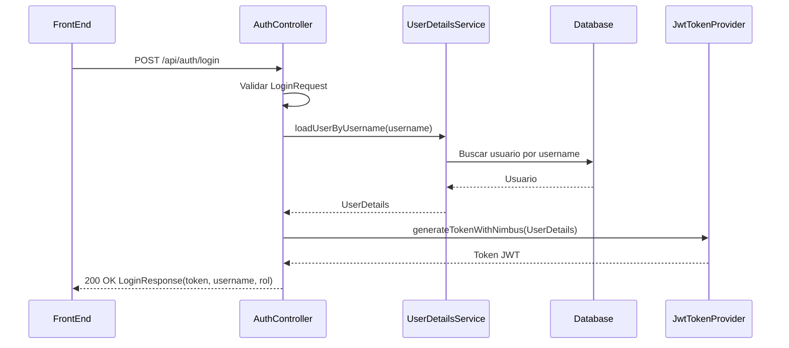
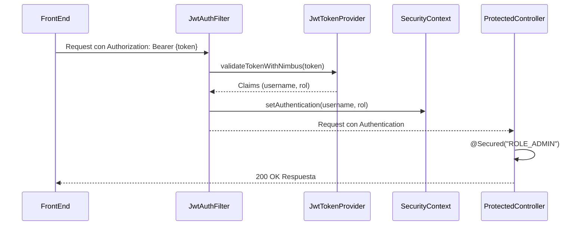

# 🔐 Plan de Trabajo - Fase 2: Autenticación y Autorización

## 🎯 Objetivos
1. Implementar autenticación basada en JWT usando la librería Nimbus JOSE+JWT
2. Crear flujo de login y generación de tokens
3. Asegurar endpoints protegidos con autorización basada en roles
4. Manejar errores y validaciones relacionados a autenticación 
5. Alcanzar una cobertura de tests unitarios y de integración de al menos 80%

## 📚 Integración de Nimbus JOSE+JWT 

### Dependencias Maven
```xml
<dependency>
    <groupId>com.nimbusds</groupId>
    <artifactId>nimbus-jose-jwt</artifactId>
    <version>9.25.6</version>
</dependency>
```

### Generación de JWT con Nimbus
```java
// Crear header
JWSHeader header = new JWSHeader.Builder(JWSAlgorithm.HS512)
    .type(JOSEObjectType.JWT)
    .build();

// Crear payload
JWTClaimsSet payload = new JWTClaimsSet.Builder()
    .subject(usuario.getUsername())              // sub = username
    .issueTime(new Date())                        // iat
    .expirationTime(new Date(System.currentTimeMillis() + EXPIRATION_TIME)) // exp
    .issuer("castlecsr-backend")                   // iss
    .claim("role", usuario.getRol())               // role (string simple)
    .build();

// Crear JWS object
JWSObject jws = new JWSObject(header, new Payload(payload.toJSONObject()));

// Firmar con clave secreta
jws.sign(new MACSigner(secretKey));

// Serializar a string compacta
String jwtToken = jws.serialize();
```

### Validación de JWT con Nimbus
```java
// Parsear token compacto
JWSObject jws = JWSObject.parse(jwtToken);

// Crear verificador con clave secreta  
JWSVerifier verifier = new MACVerifier(secretKey);

// Verificar firma
if (!jws.verify(verifier)) {
    throw new JwtInvalidSignatureException();
}

// Extraer payload
JWTClaimsSet payload = JWTClaimsSet.parse(jws.getPayload().toJSONObject());

// Verificar expiración
Date expTime = payload.getExpirationTime();
if (expTime == null || expTime.before(new Date())) {
    throw new JwtExpiredException();  
}

// Obtener claims
String username = payload.getSubject();       // sub
String role = payload.getStringClaim("role"); // custom claim
```

### 🧾 Estructura de Claims — Versión Final

| Claim | Nombre | Valor | Tipo |
|-------|--------|-------|------|
| `sub` | Subject | `usuario.getUsername()` → ej. `"jgomez"` | String |
| `iat` | Issued At | Timestamp de emisión | Date |
| `exp` | Expiration | Timestamp de expiración | Date |
| `iss` | Issuer | `"castlecsr-backend"` | String |
| `role` | Rol (custom) | `"ADMIN"` / `"USER"` / `"GUEST"` | String |

**Notas de diseño:**
- Se usa `username` como `sub` en lugar del `id` numérico, para que `CustomUserDetailsService.loadUserByUsername()` reciba directamente el valor del claim sin consultas adicionales.
- No se incluye un claim `username` separado, ya que sería redundante con `sub`.
- `role` se mantiene como un string simple (no array), ya que cada usuario tiene un único rol. Si en el futuro se requiere multi-rol, este claim deberá migrarse a una lista (`claim("roles", List.of(...))`).

### 🔑 Gestión del `JWT_SECRET`

El proyecto ya define una estrategia de secretos en `.env` / `.env.example` (ver `GUIA-RAPIDA-SECRETOS.md` y `PROTECCION-SECRETOS.md`). Para la firma JWT con Nimbus se reutiliza exactamente el mismo mecanismo:

| Entorno | Origen del `JWT_SECRET` |
|---------|--------------------------|
| Desarrollo local | Archivo `.env` (nunca se sube a Git) |
| Repositorio | `.env.example` con valor de plantilla (`tu_jwt_secret_aleatorio_aqui`) |
| Producción | Variable de entorno del sistema o Secrets Manager (AWS/Azure/GCP) |

**Algoritmo elegido:** `HS512` → requiere una clave de **al menos 512 bits (64 bytes)**. Nimbus lanza una excepción si la clave es más corta.

**Generación del secreto:**

Una forma segura de generar el valor aleatorio es usar OpenSSL:

```bash
openssl rand -base64 64
```

Este comando:
- Genera 64 bytes aleatorios seguros
- Los codifica en Base64 automáticamente
- Retorna un string de ~90 caracteres que es apto para usar directamente en `.env`

Ejemplo de salida:
```
ewCmu7BYvr4uNm/aljwjVsBtBlsJ01oIdbLyjKf8YcdqpQHZcGR0u4S0qMPEeoAf7dYndEb4vCI1efajawWXIQ==
```

**Carga en `application-local.properties`:**
```properties
jwt.secret=${JWT_SECRET:default-secret}
```

**Uso en código:**

El valor se almacena en Base64 en `.env`, pero antes de usar con Nimbus debe decodificarse:

```java
@Value("${jwt.secret}")
private String jwtSecretProperty;  // Carga valor Base64 desde .env

// Decodificar de Base64 a bytes
byte[] secretBytes = Base64.getDecoder().decode(jwtSecretProperty);

// Usar con Nimbus
MACSigner signer = new MACSigner(secretBytes);  // Ahora tiene los 64 bytes reales
```

⚠️ **Reglas:**
- Nunca hardcodear el secreto en el código ni en `application.properties`.
- Usar `openssl rand -base64 64` para generar un secreto seguro y aleatorio.
- Almacenar el secreto generado únicamente en `.env` (nunca en Git).
- Rotar el `JWT_SECRET` si se sospecha que fue comprometido (invalidará todos los tokens activos).
- En producción, preferir un Secrets Manager sobre variables de entorno planas cuando sea posible.

## 🗒️ Tareas Desglosadas

### 🔑 Autenticación JWT
1. Integrar librería Nimbus JOSE+JWT vía Maven
2. Definir estructura y claims personalizados del token JWT
3. Configurar generación de tokens JWT después de login exitoso usando Nimbus
4. Implementar filtro de validación de tokens en cada request con Nimbus
5. Manejar y propagar errores de tokens inválidos o expirados

### 🎫 Endpoint de Login
1. Crear `AuthController` con endpoint POST `/api/auth/login` 
2. Definir y crear DTO `LoginRequest` con `username` y `password`
3. Validar formato de `LoginRequest` y manejar errores
4. Verificar credenciales contra `UserDetailsService`
5. Generar y retornar token JWT en caso de login exitoso usando Nimbus
6. Devolver `LoginResponse` con token y datos básicos de usuario
7. Manejar errores de credenciales inválidas con mensaje genérico
8. Escribir tests unitarios y de integración para `/api/auth/login`

### 👮 Autorización con Roles
1. Definir roles de usuario (ADMIN, USER, GUEST)
2. Actualizar entidad `Usuario` con campo `rol` (string)  
3. Cargar rol de usuario en `UserDetailsService`
4. Incluir rol en token JWT generado con Nimbus
5. Implementar anotación `@Secured` en endpoints protegidos
6. Restringir endpoints según rol (e.g. solo ADMIN puede borrar)
7. Propagar `AccessDeniedException` con mensaje claro en caso de rol inválido
8. Escribir tests para verificar autorización basada en roles

### 🛡️ Seguridad Adicional  
1. Deshabilitar sesiones de Spring Security (stateless)
2. Configurar CORS para aceptar solo origins permitidos
3. Prevenir ataques de fuerza bruta con bloqueo de cuenta después de N intentos
4. Implementar logout para invalidar token JWT
5. Firmar tokens JWT con algoritmo seguro (e.g. HS512) usando Nimbus

## 🏗️ Diseño Técnico

### 📦 Componentes principales
- `AuthController`: Endpoints de autenticación (login, logout, refresh token)
- `JwtTokenProvider`: Generación y validación de tokens JWT con Nimbus
- `CustomUserDetailsService`: Carga usuario de base de datos por username
- `JwtAuthenticationFilter`: Filtro que valida token JWT en cada request usando Nimbus
- `SecurityConfig`: Configuración global de seguridad y autorización

### 🌐 Diagrama de Secuencia - Login Exitoso


### 🔒 Diagrama de Secuencia - Request con Token JWT


## 🧪 Plan de Pruebas

### Pruebas Unitarias  
- `AuthControllerTest`: Verifica manejo de requests válidos e inválidos
- `JwtTokenProviderTest`: Prueba generación y validación de tokens JWT con Nimbus
- `CustomUserDetailsServiceTest`: Verifica carga correcta de usuarios

### Pruebas de Integración
- `AuthFlowTest`: Prueba flujo completo de login, generación de token JWT con Nimbus y uso en requests
- `AuthorizationTest`: Verifica que endpoints estén asegurados por rol 
  
## ⏰ Tiempos Estimados
- Investigación y diseño: 6h
- Configuración de Nimbus JOSE+JWT: 4h  
- Endpoint de Login: 8h
- Autorización basada en Roles: 8h
- Seguridad adicional: 8h
- Tests unitarios y de integración: 16h
- Pruebas manuales y ajustes: 8h

**Tiempo Total Estimado: 58 horas**

## 📋 Checklist Fase 2
- [ ] Librería Nimbus JOSE+JWT integrada 
- [ ] Autenticación JWT configurada y funcionando
- [ ] Endpoint de login genera tokens JWT con Nimbus y credenciales válidas
- [ ] Endpoints protegidos requieren token JWT válido generado con Nimbus
- [ ] Autorización basada en roles implementada
- [ ] Errores de autenticación y autorización bien manejados
- [ ] Seguridad adicional (CORS, fuerza bruta) configurada
- [ ] Tests unitarios cubren al menos 80% del código relevante  
- [ ] Tests de integración cubren flujos principales
- [ ] Documentación (Readme, Wiki) actualizada
- [ ] Aprobación de Arquitectura y Seguridad
- [ ] Code Review completado
- [ ] Pruebas de aceptación completadas con éxito
