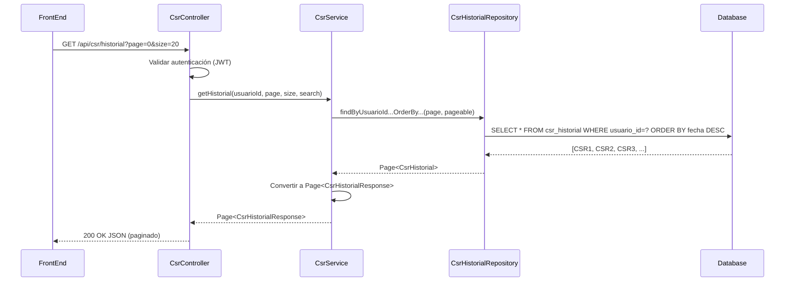

# 📋 Plan de Trabajo - Fase 4: Historial de CSR

## 🎯 Objetivos

1. Implementar endpoints REST para consultar historial de CSRs del usuario autenticado
2. Agregar paginación y búsqueda en el historial
3. Implementar detalles de un CSR específico (solo el propietario puede verlo)
4. Crear DTO de respuesta para historial
5. Agregar métodos de consulta al repositorio existente
6. Validar seguridad: cada usuario solo ve su propio historial
7. Alcanzar cobertura de tests unitarios ≥80%

## 📚 Reutilización de código existente

✅ **Ya existe desde Fase 1:**
- `CsrHistorial.java` (entidad JPA)
- `CsrHistorialRepository.java` (JpaRepository)
- Conexión a PostgreSQL
- Tabla `csr_historial`

✅ **Ya existe desde Fase 2:**
- Autenticación JWT (SecurityContext)
- `CustomUserDetailsService.loadUsuarioEntity()`
- `GlobalExceptionHandler` (se agregan nuevos handlers)

✅ **Ya existe desde Fase 3:**
- `CsrService.generateCsr()` (persistencia ya incluida)
- `CsrController.java` (se agregan nuevos endpoints)

**Conclusión:** Fase 4 es **mínimamente invasiva** — solo agregar endpoints y DTOs, sin modificar código crítico.

---

## 🗒️ Tareas Desglosadas

### 1️⃣ Verificar estructura de `CsrHistorial`

**Status:** Revisar si la entidad JPA existente tiene todos los campos necesarios.

```
CsrHistorial debe tener:
- id (String/UUID) ✅ Creado en Fase 3
- usuarioId (Long) ✅ Creado en Fase 3
- cn (String) ✅ Creado en Fase 3
- organization (String) ✅ Creado en Fase 3
- algorithm (String) ✅ Creado en Fase 3
- fechaGeneracion (LocalDateTime) ✅ Creado en Fase 3
- ⚠️ Confirmar: ¿existen índices en usuario_id y fechaGeneracion?
- ⚠️ Confirmar: ¿fechaGeneracion está marked como @Temporal o @CreationTimestamp?
```

### 2️⃣ Crear DTO `CsrHistorialResponse.java`

1. Crear clase con campos: id, cn, organization, algorithm, fechaGeneracion
2. Constructores: vacío y con parámetros
3. Getters y setters
4. (Opcional) Agregar @ToString, @EqualsAndHashCode

### 3️⃣ Extender `CsrHistorialRepository.java`

Agregar métodos de consulta si no existen:

```java
// Historial paginado del usuario (ordenado por fecha DESC)
Page<CsrHistorial> findByUsuarioIdOrderByFechaGeneracionDesc(Long usuarioId, Pageable pageable);

// Búsqueda por CN (del usuario)
Page<CsrHistorial> findByUsuarioIdAndCnContainingIgnoreCaseOrderByFechaGeneracionDesc(
    Long usuarioId, String cn, Pageable pageable);

// CSR específico del usuario
Optional<CsrHistorial> findByIdAndUsuarioId(String id, Long usuarioId);
```

### 4️⃣ Extender `CsrService.java`

Agregar métodos de negocio:

```java
// 1. getHistorial(usuarioId, page, size, searchCn)
//    → Page<CsrHistorialResponse>
//    Validar: usuario autenticado

// 2. getCsrDetails(csrId, usuarioId)
//    → CsrHistorialResponse
//    Validar: usuario es propietario del CSR
//    Si no: lanzar AccessDeniedException

// 3. Métodos auxiliares:
//    → convertToCsrHistorialResponse(CsrHistorial)
//    → validarPropiedad(csrId, usuarioId)
```

### 5️⃣ Crear/Extender endpoints en `CsrController.java`

1. **GET `/api/csr/historial`**
   - Query params: `page=0`, `size=20`, `search=` (opcional)
   - Requiere autenticación (JWT de Fase 2)
   - Devuelve `Page<CsrHistorialResponse>` con paginación

2. **GET `/api/csr/{id}`**
   - Path param: `id` (csrId)
   - Requiere autenticación
   - Devuelve `CsrHistorialResponse` de ese CSR
   - Validar que el usuario es propietario

### 6️⃣ Validaciones

1. **Paginación:**
   - page ≥ 0
   - size entre 1 y 100 (máximo)
   - Ordenamiento fijo: `fechaGeneracion DESC` (más recientes primero)

2. **Búsqueda (search CN):**
   - Case-insensitive
   - Wildcards permitidos (LIKE en BD)
   - Máximo 64 caracteres

3. **Seguridad:**
   - Usuario autenticado (JWT válido)
   - Usuario solo ve su propio historial
   - 404 si CSR no pertenece al usuario (no exponer 403)

### 7️⃣ Excepciones y manejo de errores

Agregar handlers a `GlobalExceptionHandler.java`:

```java
@ExceptionHandler(AccessDeniedException.class)
// → 403 Forbidden (usuario intenta acceder a CSR de otro)

@ExceptionHandler(EntityNotFoundException.class)
// → 404 Not Found (CSR no existe o no pertenece al usuario)
```

### 8️⃣ Frontend (sin cambios de backend requeridos)

El frontend ya espera estos endpoints (según `app.js`):
- GET `/api/csr/historial` → mostrar tabla
- GET `/api/csr/{id}` → mostrar detalles en modal

**Acción:** Confirmar que `app.js` hace estas llamadas correctamente.

---

## 🏗️ Diseño Técnico

### 📦 Estructura de clases

```
com.castlecsr/
├── dto/
│   └── CsrHistorialResponse.java      ← 🆕 NUEVO
│
├── repository/
│   └── CsrHistorialRepository.java    ← ✏️ MODIFICAR (agregar métodos)
│
├── service/
│   └── CsrService.java                ← ✏️ MODIFICAR (agregar métodos)
│
├── controller/
│   └── CsrController.java             ← ✏️ MODIFICAR (agregar endpoints)
│
└── exception/
    └── GlobalExceptionHandler.java    ← ✏️ MODIFICAR (agregar handlers)
```

### 🌐 Diagrama de Secuencia - GET /api/csr/historial



### 📊 Respuesta esperada

```json
{
  "content": [
    {
      "id": "550e8400-e29b-41d4-a716-446655440000",
      "cn": "example.com",
      "organization": "ACME Corp",
      "algorithm": "RSA-2048",
      "fechaGeneracion": "2026-07-24T10:30:00"
    },
    {
      "id": "660e8400-e29b-41d4-a716-446655440001",
      "cn": "test.com",
      "organization": "Test Corp",
      "algorithm": "EC-secp256r1",
      "fechaGeneracion": "2026-07-23T14:15:00"
    }
  ],
  "pageable": {
    "pageNumber": 0,
    "pageSize": 20,
    "totalElements": 2,
    "totalPages": 1
  }
}
```

### 🔒 Seguridad por roles

| Acción | Admin | User | Guest |
|--------|-------|------|-------|
| GET `/api/csr/historial` (propio) | ✅ Sí | ✅ Sí | ❌ No |
| GET `/api/csr/{id}` (propio) | ✅ Sí | ✅ Sí | ❌ No |
| GET `/api/csr/{id}` (de otro) | ❌ No (404) | ❌ No (404) | ❌ No (401) |

---

## ✅ Criterios de Aceptación

1. Endpoint GET `/api/csr/historial` devuelve `Page<CsrHistorialResponse>` paginada
2. Ordenamiento por fecha: más recientes primero (DESC)
3. Parámetros: `page`, `size`, `search` (opcional)
4. Seguridad: usuario solo ve su propio historial
5. Búsqueda por CN: case-insensitive, con wildcards
6. Endpoint GET `/api/csr/{id}` devuelve detalles de CSR específico
7. Validación: acceso denegado si CSR no pertenece al usuario (devuelve 404, no 403)
8. Paginación válida: size máximo 100, page ≥ 0
9. Cobertura de tests ≥80%
10. Todos los endpoints requieren autenticación JWT (Fase 2)

---

## 🧪 Plan de Pruebas

### Pruebas Unitarias

- **`CsrHistorialRepositoryTest`**:
  - `findByUsuarioIdOrderBy...` devuelve historial del usuario
  - `findByUsuarioIdAndCnContaining...` filtra por CN
  - `findByIdAndUsuarioId` devuelve CSR específico
  - Paginación: página 0 con size 20 funciona
  - Ordenamiento: más recientes primero

- **`CsrServiceTest`** (extender tests de Fase 3):
  - `getHistorial()` con paginación
  - `getCsrDetails()` acceso permitido (propietario)
  - `getCsrDetails()` acceso denegado (no propietario)
  - Búsqueda por CN case-insensitive

- **`CsrControllerTest`** (extender tests de Fase 3):
  - GET `/api/csr/historial` con autenticación (200 OK)
  - GET `/api/csr/historial` sin autenticación (401)
  - GET `/api/csr/{id}` propietario (200 OK)
  - GET `/api/csr/{id}` no propietario (404)
  - Paginación: size=5 devuelve 5 items
  - Búsqueda: search=example filtra correctamente

### Pruebas de Integración

- **`CsrHistorialIntegrationTest`**:
  - Login → Generar CSR → Consultar historial → Ver detalles
  - Login Usuario A → Ver historial → Intentar acceder a CSR de Usuario B (404)
  - Paginación: generar 30 CSRs, paginar con size=10

### Pruebas Manuales (curl)

```bash
# 1. Login
curl -i -c cookies.txt -X POST http://localhost:8080/api/auth/login \
  -H "Content-Type: application/json" \
  -d '{"username":"jgomez","password":"password"}'

# 2. Historial (página 0, 20 items)
curl -i -b cookies.txt 'http://localhost:8080/api/csr/historial?page=0&size=20'

# 3. Historial con búsqueda
curl -i -b cookies.txt 'http://localhost:8080/api/csr/historial?page=0&size=20&search=example'

# 4. Detalles de CSR específico
curl -i -b cookies.txt 'http://localhost:8080/api/csr/550e8400-e29b-41d4-a716-446655440000'

# 5. Intentar acceder a CSR de otro usuario (debe devolver 404)
curl -i -b cookies.txt 'http://localhost:8080/api/csr/OTRO_CSR_ID'
```

---

## ⏰ Tiempos Estimados

- Verificar/crear DTO y extender repositorio: 2h
- Agregar métodos a CsrService: 3h
- Implementar endpoints en CsrController: 3h
- Validaciones y manejo de errores: 2h
- Tests unitarios: 5h
- Tests de integración: 2h
- Pruebas manuales y ajustes: 2h

**Tiempo Total Estimado: 19 horas**

---

## 📋 Checklist Fase 4

### Backend

- [x] DTO `CsrHistorialResponse.java` creado
- [x] Métodos en `CsrHistorialRepository.java` agregados
- [x] Métodos en `CsrService.java` agregados:
  - [x] `getHistorial(usuarioId, page, size, search)`
  - [x] `getCsrDetails(csrId, usuarioId)`
- [x] Endpoints en `CsrController.java`:
  - [x] GET `/api/csr/historial` (paginado, búsqueda)
  - [x] GET `/api/csr/{id}` (detalles)
- [x] Validaciones:
  - [x] Seguridad: usuario solo ve su historial
  - [x] Paginación: size máximo 100
  - [x] Búsqueda: case-insensitive
- [x] Handlers en `GlobalExceptionHandler.java`:
  - [x] `AccessDeniedException` → 403
  - [x] `EntityNotFoundException` → 404
- [x] Tests unitarios cubren ≥80%
- [x] Tests de integración cubren flujo completo
- [ ] Pruebas manuales con curl exitosas
- [ ] Code review completado
- [x] Documentación de API actualizada

### Frontend

- [x] Confirmar que `app.js` hace GET `/api/csr/historial`
- [x] Confirmar que `app.js` hace GET `/api/csr/{id}`
- [x] Tabla HTML con historial (si es necesario)
- [x] Modal de detalles (si es necesario)

### Finalización

- [ ] Tag `v1.0.0-phase4` creado en Git
- [x] Documentación actualizada

---

## 🎯 Diferencias con Fase 3

| Aspecto | Fase 3 | Fase 4 |
|---------|--------|--------|
| Complejidad | 🔴 Alta | 🟢 Baja |
| Líneas de código | 500+ | 150-200 |
| Nuevas dependencias | BouncyCastle | Ninguna |
| Cambios en BD | Nuevas tablas/columnas | Solo consultas |
| Tiempo estimado | 40h | 19h |
| Tests | 24 tests | ~8-10 tests nuevos |

**Fase 4 es ~50% más corta que Fase 3** ✅

---

## 📞 Preguntas pendientes a usuario

1. ¿`CsrHistorial` tiene índices en `usuario_id` y `fechaGeneracion`?
2. ¿El campo `fechaGeneracion` está correctamente mapeado (LocalDateTime)?
3. ¿El `CsrHistorialRepository` ya existe con métodos básicos o necesita crearse desde cero?
4. ¿El frontend (`app.js`) ya hace GET a estos endpoints o necesita actualización?
